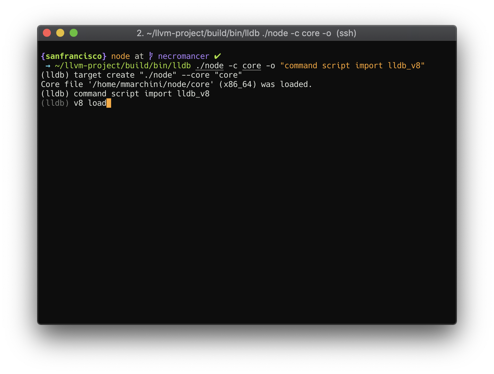
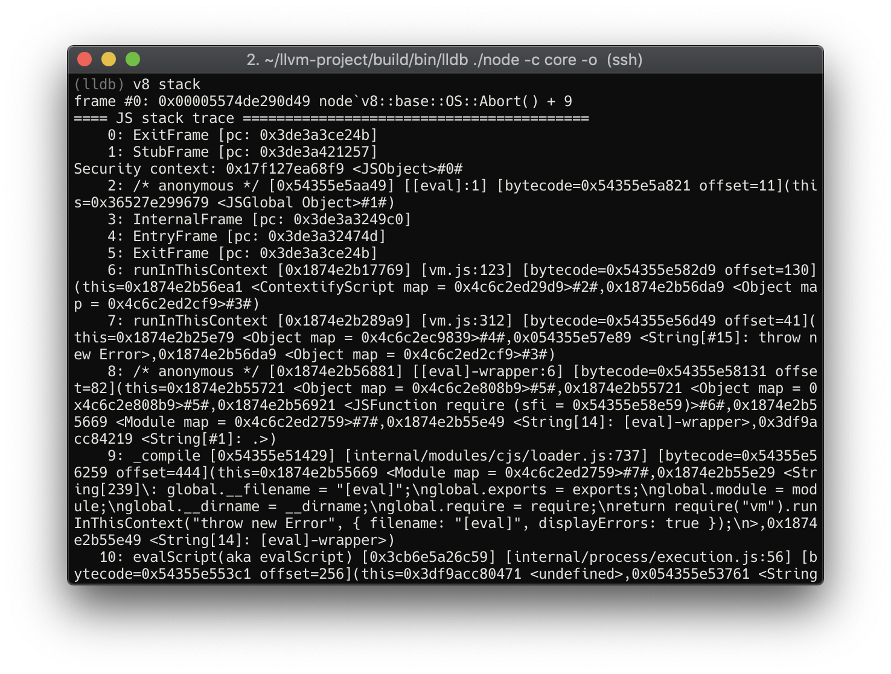
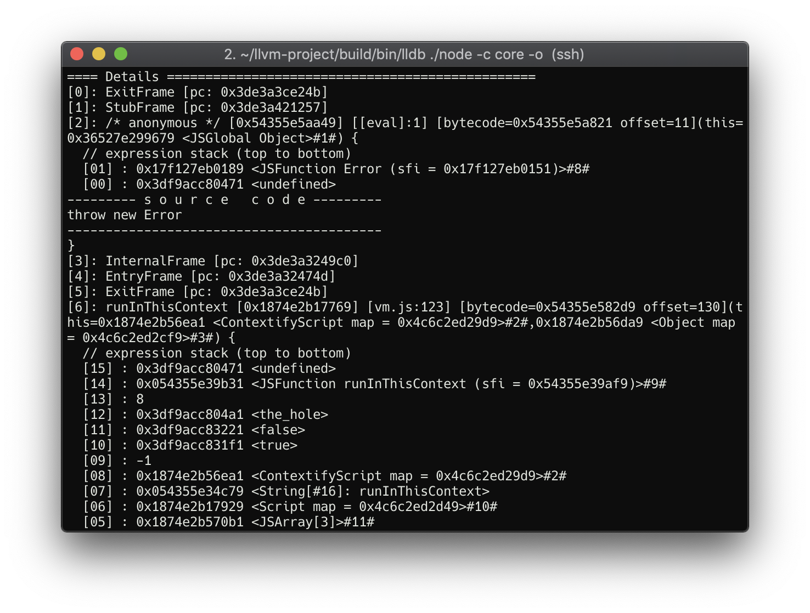
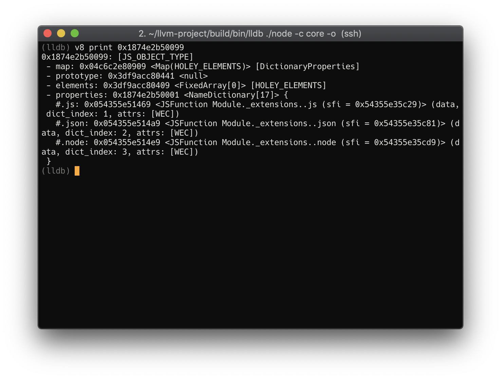

# lldb_v8

A prototype plugin which consumes the V8 postmortem API described 
[here][postmortem-api-design] and implemented [here][postmortem-api-cl].

## Goals

  * Allow debug tools to provide rich information about the data in crash dumps
  * Avoid re-implementation of existing debug printing logic
  * Minimize coupling of debug tools to internal details of V8
  * Don't impact runtime performance
  * Portable
  * Easy to incorporate in Node.js releases

## Screenshots

asciinema: https://asciinema.org/a/227038

## Design

We have two components: the Debugger and the Postmortem Host. The Debugger will
start the Postmortem Host and will handle access to the core dump contents. The
Postmortem Host will load the content of the core dump file into memory at the
same addresses used in the original process.

After the core dump content is loaded, the Debugger will communicate with the
Postmortem Host to gather data from the core dump - such as printing the
JavaScript Stack Trace or the contents of an V8 Object - by using V8 methods.

## Implementation

### IPC

Inter-process communication is implemented with two files: one will be used to 
send messages from the debugger to the host, and the other will be used to send
messages from the host to the debugger.

The format of the messages is loosely defined and should be greatly improved in
a final implementation. Alternatively an existing IPC mechanism could be used,
such as gRPC.

### Postmortem Host

The postmortem host is implemented inside Node.js behind a flag
(`--experimental-postmortem-host`). The presence of this flag is verified
before we do anything else to avoid polluting the memory with unwanted
structures. The flag will start Node.js in `Postmortem Host Mode`. The 
`Postortem Host Mode` will receive two file paths as positional arguments to be
used in inter process communication.

Incorporating the host inside Node.js was a design choice with the goal to make
the debugger easier to use (we already need the original `node` binary when
inspecting a core dump).  The code for the Postmortem Host is available at
`src/node_postmortem_host.cc`.

### Debugger

The debugger is an lldb Python plugin which starts the Postmortem Host and
sends commands to it. The Postmortem Host is started using the same binary
loaded in the debugger alongside the core dump. lldb Python API was chosen
instead of C++ to make the plugin more portable.

The first commands it sends to the Host will initialize the Postmortem Host
memory with core dump content. After that, commands will be sent to print the
stack trace and objects, according to what the user requests. The debugger will
also listen to messages sent by the Postmortem Host to access registers, tls
and static data.

## Challenges & Known Limitations

### Thread-local Storage Access

Accessing thread-local storage data from core dumps on Linux debuggers is
painful. Neither `lldb` or `gdb` have features to access TLS reliably on core
dumps. Also, any plugin implementing TLS access would be tightly coupled to the
processor's architecture, as well as kernel and glibc versions.

Some references on this topic:

  * [ELF Handling for Thread-Local Storage](https://akkadia.org/drepper/tls.pdf)
  * [Debugging thead variables from coredumps](https://www.technovelty.org/linux/debugging-__thead-variables-from-coredumps.html)
  * [glibc source code](https://sourceware.org/git/?p=glibc.git)

### Address Space Layout Randomisation & Position Independent Executables

On Ubuntu 18.04 (where the tests were conducted), Address Space Layout
Randomisation (ASLR) is enabled by default system-wide and Position Independent
Executables (PIE) is enabled by default in the compiler (gcc 7.3.0). Because of
that, every time we start the postmortem host we'll likely end up with
different addresses for our code sections, which is good because it helps avoid
memory conflicts when resurrecting the core dump.

On the other hand, this is a problem because some pieces of code will run
relatively to the addresses from the core dump. As such, we have to load
executable code from the core dump as `PROT_EXEC` (executable), which could
result in a security hole when dealing with untrusted core dumps.

Among the executable sections we have to load (found out by trial and error),
we need a copy of the `node` code segment loaded in the same addresses we had
in the original process. For some reason `lldb` can't read correctly this
segment from the core dump (part of the segment will be filled by zeros if we
try to do that). Therefore, the prototype will duplicate the code segment from
the postmortem host into the same address it was loaded in the original
process.

### Commands output

V8 Print methods have an unstructured output, which makes it difficult to parse
and manipulate data. A possible improvement would be to output the results from
Print method as JSON objects.

### Security

TBD

## Observations

This prototype uses a custom `lldb` built from
https://github.com/mmarchini/llvm-project/tree/fs_gs_base.

[postmortem-api-design]: https://docs.google.com/document/d/1aYHJoWROM5U5ULhCzwBfRPuMpSLnLg9Zt0fKEuGgUZQ/edit#
[postmortem-api-cl]: https://chromium-review.googlesource.com/c/v8/v8/+/1435770
